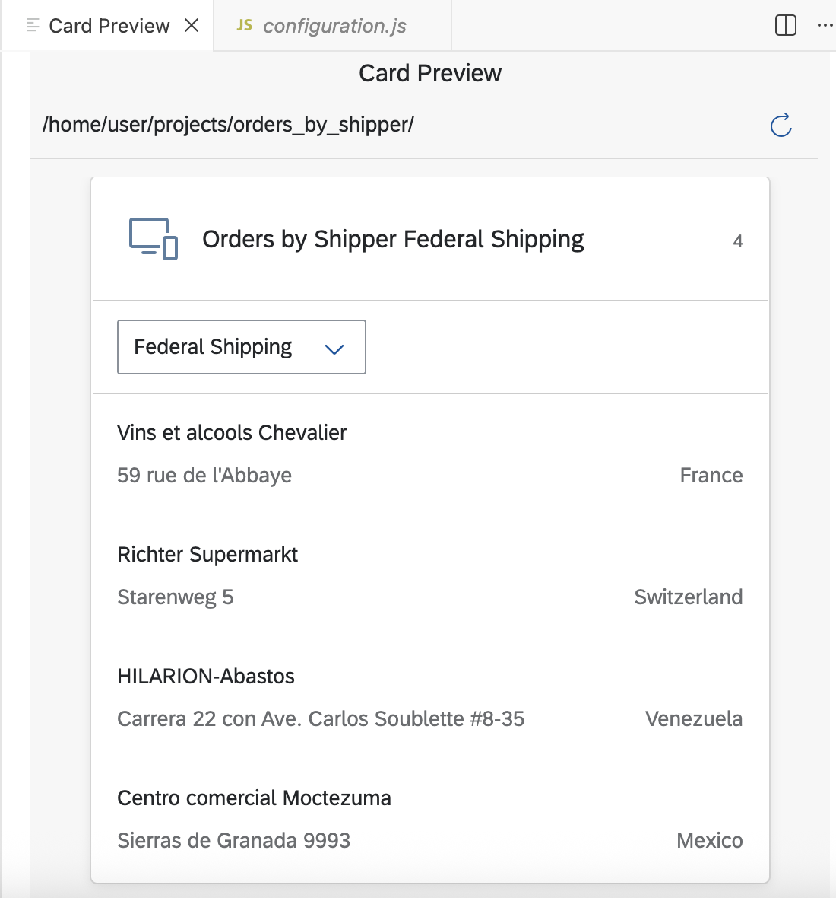

This repository shows the codes for a UI5 Integration Card that Displays Data from the Northwind Demo System created in **SAP Business Appication Studio** following the tutorial *Experience SAP Build By Creating an End-to-End Sales Scenario* (https://account.hanatrial.ondemand.com/trial/#/home/trial).
The card should look like this:

